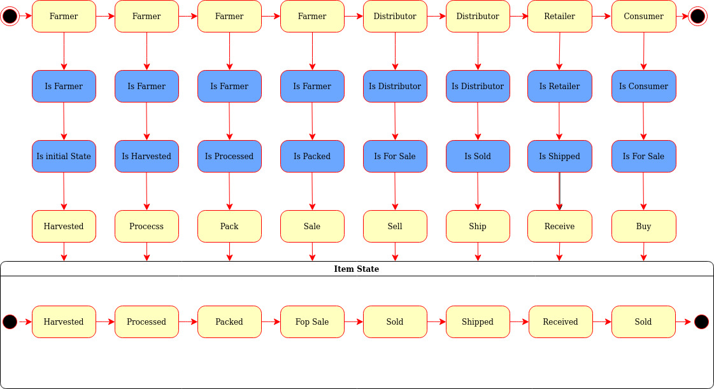

# Supply chain & data auditing

From account:
0xbDc52D0146298216fB1E55c8f20f4f01d78A4FFa

# Contracts addresses:

FarmerRole: 0x40ce5f5989955ec582ea772b05da97b984c21464
https://rinkeby.etherscan.io/address/0xbff47008d577153490326bfd21ab474db247688f

DistributorRole: 0x81891c37ccb4a3d1fda9ef7027f421eb0f1bf1c0
https://rinkeby.etherscan.io/address/0x81891c37ccb4a3d1fda9ef7027f421eb0f1bf1c0

RetailerRole: 0x41ff89ad17193ececbfacff4b862e122f0f07903
https://rinkeby.etherscan.io/address/0x41ff89ad17193ececbfacff4b862e122f0f07903

ConsumerRole: 0x059e01a682a94a2d2be72d77717dfe8a1362bf38
https://rinkeby.etherscan.io/address/0x059e01a682a94a2d2be72d77717dfe8a1362bf38

SupplyChain:0xbff47008d577153490326bfd21ab474db247688f
https://rinkeby.etherscan.io/address/0xbff47008d577153490326bfd21ab474db247688f

# Migration messages:
Running migration: 1_initial_migration.js
  Deploying Migrations...
  ... 0x6de31faffbd5960429b86bc033e400aa4a825b798a21613c90f48c0c10a9afa2
  Migrations: 0x20518880310bc59039f8a890d3a14c8d6be66cc5
Saving successful migration to network...
  ... 0xae3a339cc9863a224880de58eff540c9bf9bed5ea643c9d5b1130538f1900762
Saving artifacts...
Running migration: 2_deploy_contracts.js
  Deploying FarmerRole...
  ... 0xbb95b0c584e73c2d1e4dd7c1d16a57233ffa159d83c4f0c2a63a36dc4c8f265a
  FarmerRole: 0x40ce5f5989955ec582ea772b05da97b984c21464
  Deploying DistributorRole...
  ... 0xfaa1ddf46008c31987f22cbc009c9322a91043002421237ff0327eb4e04f685a
  DistributorRole: 0x81891c37ccb4a3d1fda9ef7027f421eb0f1bf1c0
  Deploying RetailerRole...
  ... 0x77dc00cbe184d47ee2dd592cf103fdd30bf55784c44ed93e7f5da3c113395d14
  RetailerRole: 0x41ff89ad17193ececbfacff4b862e122f0f07903
  Deploying ConsumerRole...
  ... 0xaafd1d171791014153de5261566f73822f94a965f28074a6b3d49a085ca8ad22
  ConsumerRole: 0x059e01a682a94a2d2be72d77717dfe8a1362bf38
  Deploying SupplyChain...
  ... 0xf0cbdc0a26d1ca11caef05ca04ed314f1ee3062acce786b7ac80f46ea311e38e
  SupplyChain: 0xbff47008d577153490326bfd21ab474db247688f
Saving successful migration to network...
  ... 0x092db2dd65fb986d3f2dd102ddcc46e18e6f6ebff10b6d676c6bc4ff988de74f
Saving artifacts...

Frameworks and libraries Versions:
Node: 12.0.0

Truffle 5.5.21 (core: 5.5.21)

Ganache 7.2.0

Solidity 0.5.16 (solc-js)

Web3 was installed as part of the project since Truffle Web3 was newer and not compatible:
Web3.js: 0.20.1

# Screenshot of testing results


# UML Diagrams
# Activity:


# Class:


# Sequence:


# State:



This repository containts an Ethereum DApp that demonstrates a Supply Chain flow between a Seller and Buyer. The user story is similar to any commonly used supply chain process. A Seller can add items to the inventory system stored in the blockchain. A Buyer can purchase such items from the inventory system. Additionally a Seller can mark an item as Shipped, and similarly a Buyer can mark an item as Received.

The DApp User Interface when running should look like...


## Getting Started

These instructions will get you a copy of the project up and running on your local machine for development and testing purposes. See deployment for notes on how to deploy the project on a live system.

### Prerequisites

Please make sure you've already installed ganache-cli, Truffle and enabled MetaMask extension in your browser.

```
Give examples (to be clarified)
```

### Installing

> The starter code is written for **Solidity v0.4.24**. At the time of writing, the current Truffle v5 comes with Solidity v0.5 that requires function *mutability* and *visibility* to be specified (please refer to Solidity [documentation](https://docs.soliditylang.org/en/v0.5.0/050-breaking-changes.html) for more details). To use this starter code, please run `npm i -g truffle@4.1.14` to install Truffle v4 with Solidity v0.4.24. 

A step by step series of examples that tell you have to get a development env running

Clone this repository:

```
git clone https://github.com/udacity/nd1309/tree/master/course-5/project-6
```

Change directory to ```project-6``` folder and install all requisite npm packages (as listed in ```package.json```):

```
cd project-6
npm install
```

Launch Ganache:

```
ganache-cli -m "spirit supply whale amount human item harsh scare congress discover talent hamster"
```

Your terminal should look something like this:


In a separate terminal window, Compile smart contracts:

```
truffle compile
```

Your terminal should look something like this:


This will create the smart contract artifacts in folder ```build\contracts```.

Migrate smart contracts to the locally running blockchain, ganache-cli:

```
truffle migrate
```

Your terminal should look something like this:


Test smart contracts:

```
truffle test
```

All 10 tests should pass.


In a separate terminal window, launch the DApp:

```
npm run dev
```

## Built With

* [Ethereum](https://www.ethereum.org/) - Ethereum is a decentralized platform that runs smart contracts
* [IPFS](https://ipfs.io/) - IPFS is the Distributed Web | A peer-to-peer hypermedia protocol
to make the web faster, safer, and more open.
* [Truffle Framework](http://truffleframework.com/) - Truffle is the most popular development framework for Ethereum with a mission to make your life a whole lot easier.


## Authors

See also the list of [contributors](https://github.com/your/project/contributors.md) who participated in this project.

## Acknowledgments

* Solidity
* Ganache-cli
* Truffle
* IPFS
